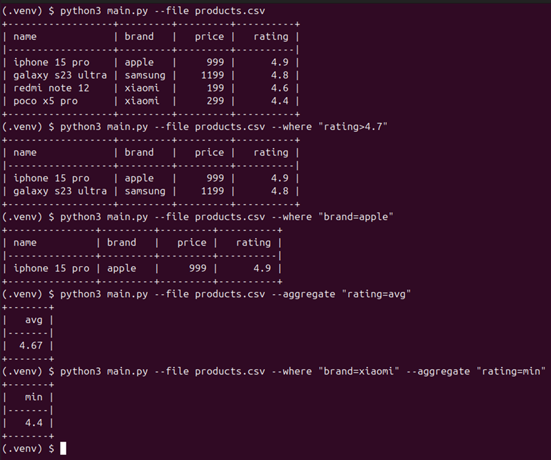
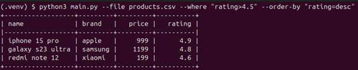

# Обработка csv файла

# Что нужно сделать?

Нужно написать скрипт для обработки CSV-файла, поддерживающий операции:

- фильтрацию с операторами «больше», «меньше» и «равно»
- агрегацию с расчетом среднего (avg), минимального (min) и максимального (max) значения

> Собираем прототип, поэтому всё по простому. Фильтрацию и агрегацию делаем по одной любой колонке. Делать фильтрации с составными условия, например с and или or, а также по нескольким колонкам одновременно не нужно. Фильтрация поддерживает любые колонки, то есть с текстовыми и числовыми значениями, а агрегация только числовые. Гарантируется что входные файлы валидны, например если в колонке числа, то там все значения числа. Чтобы сфокусироваться на функционале и не отвлекаться на рутинные задачи (обработка аргументов скрипта, чтение файла и форматированный вывод), можно использовать стандартную библиотеку argparse и csv, а для красивого отображения в консоли установить библиотеку tabulate.
> 

*Пример файла csv:*

```xml
name,brand,price,rating
iphone 15 pro,apple,999,4.9
galaxy s23 ultra,samsung,1199,4.8
redmi note 12,xiaomi,199,4.6
poco x5 pro,xiaomi,299,4.4
```

*Пример запуска скрипта:*



## Функциональные требования

- можно передать путь к файлу
- можно указать условие фильтрации
- можно указать условие агрегации
- в консоль выводится таблица с результатами выборки или агрегации

## Не функциональные требования

- для всего кроме тестов и красивого вывода в консоль, можно использовать только стандартную библиотеку, например:
    - для работы с параметрами скрипта нельзя использовать click, но можно использовать argparse
    - для чтения файлов нельзя использовать pandas, но можно использовать csv
- код покрыт тестами написанных на pytest
- для тестов можно использовать любые дополнительные библиотеки
- код соответствует:
    - общепринятым стандартам написания проектов на python
    - общепринятому стилю

## Дополнительные требования

Дополнительные требования:

- есть обработка случаев, когда пользователь при запуске скрипта указал что-то не то
- в архитектуру заложена возможность быстрого добавления новых видов агрегации или даже команд, например, если захотим добавить медиану или order by по колонке типа --order-by “brand=desc” или “brand=asc”, то это можно будет сделать не переписывая пол проекта
- в коде используются аннотации

## FAQ

- Входные файлы всегда в формате csv?
    - Да, всегда.
- Можно ли использовать нейросети?
    - Рекомендуем не использовать. Сталкиваемся со случаями, когда кандидаты увлекаются нейросетями, чтобы сделать тестовое, а потом не проходят техническое интервью, потому что не понимают, почему нейросеть написала тот или иной код.
- Будет ли приниматься задание без тестов?
    - Нет, приниматься не будет. Наличие тестов входит в основные требования.
- Код покрыт тестами - это какой процент покрытия?
    - Можно ориентироваться на 80% покрытия по [pytest-cov](https://pypi.org/project/pytest-cov/), можно больше, можно меньше, но главное чтобы был протестирован критически важный функционал.
- Можно ли использовать какие-то дополнительные библиотеки к pytest?
    - Да, всё что помогает вам тестировать код можно использовать.
- Можно ли пользоваться линтерами или форматтерами кода?
    - Да, можно использовать любой линтер или форматтер - это хорошая практика.
- Можно ли использовать pandas?
    - Нет, он не входит в стандартную библиотеку, можно использовать csv.
- Что ещё можно сделать, чтобы набрать больше баллов кроме того что описано в задание?
    - Задачи построить космический корабль нет, того что описано достаточно, но если руки чешутся, то можно добавить order by с аргументами asc и desc, например:



- Нужно ли писать комментарии в коде?
    - Если вы считаете что они нужны, то пишите.
- Нужно ли писать readme.md?
    - Писать не обязательно, но в него можно положить примеры запуска скрипта и написать то, что на ваш взгляд важно знать ревьюеру. Если будете писать readme, то пусть он будет небольшим, но по делу, чем большим, на 3 экрана и сгенерированным нейросетью.